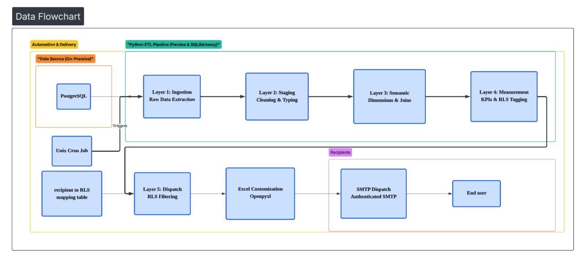

# Enterprise Automated Reporting with RLS




## English Version

### Project Overview
This project implements an automated data distribution workflow tailored for corporate environments. Using Python and SQL, it enforces Row-Level Security (RLS) to filter data based on each recipient's scope (for example by brand, department, or owner) and dispatches customized Excel reports on a scheduled basis.

### Core Objectives
- **Eliminate Manual Work**: Replace repetitive daily tasks such as manual filtering, report generation, and emailing.
- **Data Security & RLS**: Ensure the right people only see the right data.
- **Intranet Compliance**: Support on-premise deployment for enterprise networks with external access restrictions.

### Technical Features
#### 1. Dynamic RLS and List Maintenance
- **Org-Mapping Management**: Maintain recipients, organizational scope, and email addresses through `report_dispatch_map`.
- **Scalability**: Handle org changes by updating mapping data, without modifying core code.

#### 2. Delivery Stability
- **Authenticated SMTP**: Supports enterprise-grade email authentication and sending configuration.
- **Whitelisting Recommendation**: Add sender to safe lists on recipient side to improve deliverability.

### Deployment and Execution
#### Setup Environment Variables (`.env`)
```env
DB_HOST=your_internal_db_ip
MAIL_USER=your_office365_account
MAIL_PASSWORD=your_app_password
```

#### Setup Cron Job
Run every day at 16:30:
```bash
30 16 * * * cd /path/to/project && /path/to/.venv/bin/python main_dispatch.py >> cron_log.log 2>&1
```

### Value Proposition
- **Low Maintenance**: Separate recipient mapping from core logic to reduce operational complexity.
- **Data Residency**: Keep data generation and processing inside enterprise infrastructure.
- **Observability**: Built-in `cron_log.log` supports ongoing monitoring and troubleshooting.

---

## 中文版

### 專案概述
本專案開發了一套針對企業環境設計的數據自動化派發流程。透過 Python 結合 SQL 資料庫，系統可依據不同接收者的職權範圍（如品牌、部門、負責人）自動篩選資料（RLS），並定時產出客製化 Excel 報表發送給對應人員。

### 核心目標
- **消除人工耗時**：將每日手動篩選、製表與寄信流程自動化。
- **數據權限安全（RLS）**：確保「正確的人只看到正確的數據」。
- **內網資安合規**：採用地端部署（On-premise），符合企業內網與資料管控需求。

### 技術特點
#### 1. 動態 RLS 與名單維護
- **組織對照表管理**：透過維護 `report_dispatch_map` 管理人員名單、組織層級與對應信箱。
- **靈活擴充性**：組織異動時只需更新對照資料，無需更動核心程式碼。

#### 2. 交付穩定性策略
- **SMTP 驗證**：支援企業級發信權限與帳號設定。
- **白名單建議**：建議在收件端加入安全寄件者，降低報表被判定為垃圾郵件的風險。

### 部署與執行
#### 設定環境變數（`.env`）
```env
DB_HOST=your_internal_db_ip
MAIL_USER=your_office365_account
MAIL_PASSWORD=your_app_password
```

#### 設定自動排程（Cron）
每天下午 4:30 執行：
```bash
30 16 * * * cd /path/to/project && /path/to/.venv/bin/python main_dispatch.py >> cron_log.log 2>&1
```

### 專案價值
- **低維護成本**：將名單維護與程式邏輯分離，降低管理複雜度。
- **資安在地化**：資料生成流程不經第三方雲端，符合資料在地需求。
- **可觀測性**：透過 `cron_log.log` 提供日誌監控與故障排查能力。
